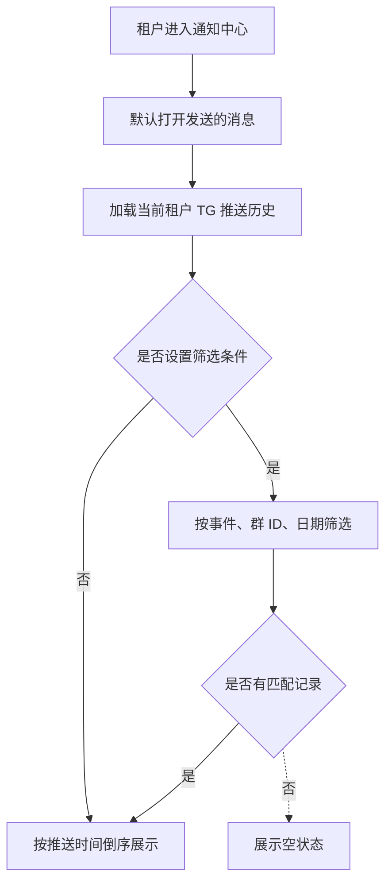
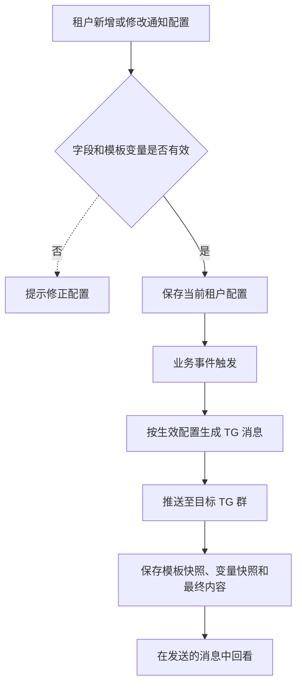
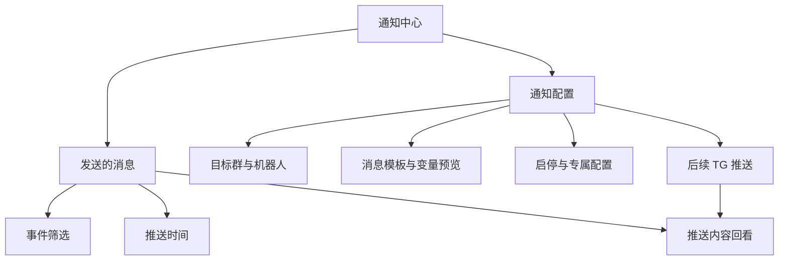

# 租户端通知中心 PRD

## 目录

- [§1 需求说明](#1-需求说明)
- [§2 背景与目标](#2-背景与目标)
- [§3 功能清单](#3-功能清单)
- [§4 功能细节规格](#4-功能细节规格)
- [§5 功能流程图](#5-功能流程图)
- [§6 功能结构图](#6-功能结构图)
- [§7 页面设计](#7-页面设计)
- [§8 异常与边界](#8-异常与边界)
- [§9 验收清单](#9-验收清单)

## 本文件使用说明

- 本文用于确认汇盛支付租户端「运营中心 → 通知中心」的业务范围与验收标准。
- 数据流、用户角色与非功能性要求见 [PRD 附录](./PRD_租户端通知中心_20260902_appendix.md)。

## §1 需求说明

本需求用于让租户在一个页面内完成两件事：查看已推送到 TG 机器人群的历史消息，以及维护本租户的通知配置。

本次包含：

1. 保留「运营中心 → 通知中心」侧栏入口，并在页面内提供两个一级页签。
2. 建设「发送的消息」TG 推送历史回看能力。
3. 建设「通知配置」维护能力。
4. 保证历史消息内容可按推送时的模板快照回看。

## §2 背景与目标

### 2.1 使用对象

- 租户运营人员：查看业务、风控与配置变更的 TG 推送历史。
- 租户管理员：维护当前租户的 TG 通知目标和消息模板。

### 2.2 建设目标

| 目标 | 达成标准 |
|---|---|
| 集中管理 | 租户只通过一个「通知中心」入口完成查看和配置。 |
| 可追溯 | 已推送的 TG 消息可按时间、事件和实际内容回看。 |
| 内容一致 | 历史内容与推送时命中的模板一致，不因后续配置变化而改变。 |
| 租户隔离 | 租户只能查看和维护自身范围内的数据。 |

### 2.3 本次不包含

- TG 机器人、TG 群和平台授权关系的创建与授权管理。
- 对历史已发送消息的撤回、编辑或再次发送。
- 平台全局风控规则的修改。

## §3 功能清单

| 页面 / 能力 | 是否必做 | 类型 | 使用端 | 简介 |
|---|---|---|---|---|
| 通知中心入口与页签 | 必做 | [MOD] | 租户端 | 保留一个侧栏入口，内含「发送的消息」「通知配置」两个一级页签。 |
| TG 推送历史 | 必做 | [MOD] | 租户端 | 回看已发送至 TG 机器人的消息，仅展示推送时间、推送事件和推送内容。 |
| 通知配置 | 必做 | [NEW] | 租户端 | 维护消息类型、TG 群、机器人、模板、状态和特殊预警参数。 |
| 历史内容快照 | 必做 | [NEW] | 租户端 | 保存并展示推送当时的模板与变量渲染结果。 |

## §4 功能细节规格

### 4.1 通知中心入口与页签

#### 4.1.1 入口与布局

- 侧栏入口固定为「运营中心 → 通知中心」，不新增「通知配置」侧栏菜单。
- 页面默认打开「发送的消息」。
- 页签顺序固定为「发送的消息」「通知配置」。
- 页面明确标识当前租户范围。

#### 4.1.2 页面规则

| 场景 | 预期结果 |
|---|---|
| 正常进入 | 默认显示 TG 推送历史。 |
| 切换页签 | 不改变当前租户范围。 |
| 无页面权限 | 不展示入口或提示无访问权限。 |
| 租户切换 | 仅显示切换后租户的数据。 |

### 4.2 发送的消息：TG 推送历史

#### 4.2.1 筛选条件

| 字段 | 类型 | 默认值 | 说明 |
|---|---|---|---|
| 推送事件 | 下拉选择 | 全部事件 | 支持按已配置的消息事件筛选。 |
| TG 群 ID | 文本输入 | 空 | 支持按当前租户已配置群的群 ID 模糊筛选。 |
| 推送日期（UTC+8） | 日期选择 | 空 | 按实际推送日期筛选。 |

#### 4.2.2 列表规则

| 列名 | 展示规则 |
|---|---|
| 推送时间（UTC+8） | 展示该条消息实际推送完成的时间。 |
| 推送事件 | 展示触发本次通知的事件名称。 |
| 推送内容 | 展示发送至 TG 群的完整消息正文，保留模板换行。 |

- 列表按推送时间倒序展示。
- 支持刷新、筛选重置和导出当前筛选结果。
- 历史内容使用推送时模板快照和当时业务变量渲染，不使用当前正在生效的模板重新计算。

#### 4.2.3 业务规则

| 场景 | 预期结果 |
|---|---|
| 推送成功 | 新增一条可回看的 TG 推送历史。 |
| 当前配置后续修改 | 已存在的历史内容保持不变。 |
| 当前配置停用或删除 | 已存在的历史记录保持可查询。 |
| 无筛选结果 | 展示空状态「暂无符合条件的 TG 推送记录」。 |

### 4.3 通知配置

#### 4.3.1 配置内容

| 配置项 | 说明 |
|---|---|
| 消息类型 | 选择当前租户支持的业务、风控或配置变更事件。 |
| TG 群 ID | 选择消息接收目标。 |
| 通知机器人 | 仅可选择平台已授权给当前租户的机器人。 |
| 风险等级 | 按消息类型自动展示。 |
| 消息模板 | 支持当前消息类型允许的变量。 |
| 状态 | 支持启用和停用。 |
| 专属配置 | 恶意拉单预警支持维护当前租户的检测阈值。 |

#### 4.3.2 操作规则

- 同一消息类型可配置多个 TG 群。
- 新增配置默认启用。
- 修改模板时，页面同步显示变量和渲染预览。
- 模板不得使用当前消息类型未提供的变量。
- 删除配置前要求填写操作原因；删除后不影响历史推送记录。
- 启停仅影响后续事件，不影响已推送内容。

#### 4.3.3 异常与边界

| 场景 | 预期结果 |
|---|---|
| 未选择消息类型、群或机器人 | 阻止保存并标出必填项。 |
| 模板包含未定义变量 | 阻止保存并提示变量名称。 |
| 操作原因少于 4 个字 | 阻止删除确认。 |
| 专属配置小于或等于 0 | 阻止保存并提示填写正整数。 |

### 4.4 历史内容快照

- 每次实际向 TG 机器人群推送时，保存该次事件、接收群、推送时间、模板快照、变量快照与最终消息内容。
- 历史列表以最终消息内容作为展示依据。
- 历史记录不可由租户编辑、删除或覆盖。
- 任何租户只能查看自身产生的推送历史。

## §5 功能流程图

### 5.1 TG 推送历史查看

### 5.2 通知配置与推送内容留存

## §6 功能结构图

## §7 页面设计

### 7.1 通知中心：发送的消息

- 默认页签为「发送的消息」。
- 页面由筛选区和 TG 推送记录列表组成。
- 列表固定展示「推送时间（UTC+8）」「推送事件」「推送内容」三列。
- 推送内容以完整正文多行展示，方便与 TG 群内的实际消息核对。

### 7.2 通知中心：通知配置

- 展示当前租户配置范围说明、筛选区和配置列表。
- 新增或修改时，以弹窗维护消息类型、TG 群 ID、机器人和模板，并展示变量说明与预览。
- 恶意拉单预警在列表操作中提供专属配置入口。

## §8 异常与边界

| 场景 | 处理规则 |
|---|---|
| 当前租户无任何配置 | 配置列表展示空状态，仍允许有权限用户新增配置。 |
| 当前租户无任何推送历史 | 发送的消息展示空状态，不显示其他租户消息。 |
| 推送内容较长 | 保留换行并自动换行展示，不截断业务正文。 |
| 模板变量值为空 | 推送时按业务规则生成可识别的空值表现，并保留最终实际发送内容。 |
| 同一事件配置多个 TG 群 | 每个群产生独立的推送历史记录。 |
| 配置已删除 | 仅停止后续推送，历史记录仍可查询。 |
| 导出当前筛选结果 | 导出内容与页面当前筛选结果一致。 |

## §9 验收清单

### 9.1 功能验收

| # | 功能名称 | 验收标准 | 判定方式 | 通过 |
|---|---|---|---|---|
| 1 | 通知中心页签 | 进入通知中心默认展示「发送的消息」，可切换至「通知配置」。 | 打开页面并切换页签。 | - [ ] |
| 2 | TG 推送历史字段 | 历史列表仅展示推送时间、推送事件、推送内容三列。 | 检查表头和任意三条记录。 | - [ ] |
| 3 | 历史内容 | 推送内容保留换行，且与该条推送的模板快照及变量值一致。 | 对照一条 TG 消息和页面记录。 | - [ ] |
| 4 | 推送历史筛选 | 事件、TG 群 ID、日期任一筛选条件生效；组合筛选结果正确。 | 分别设置条件并检查记录数和内容。 | - [ ] |
| 5 | 通知配置维护 | 可新增、修改、启停、删除配置；模板变量校验和预览可用。 | 完成一条新增和一条修改操作。 | - [ ] |
| 6 | 历史不可改写 | 修改、停用或删除配置后，已有推送历史的内容保持不变。 | 先产生历史记录，再执行三类配置操作并复查。 | - [ ] |
| 7 | 租户隔离 | 当前租户不能查看或维护其他租户的历史和配置。 | 使用两个租户账号分别核对数据。 | - [ ] |

### 9.2 非功能性验收

详见附录 A4，验收要点包括性能、安全、兼容性与可用性。

### 9.3 Corner Case 验收

| # | 场景 | 预期行为 | 判定方式 | 通过 |
|---|---|---|---|---|
| 1 | 无推送历史 | 展示空状态。 | 使用无历史的测试租户进入页面。 | - [ ] |
| 2 | 未定义模板变量 | 阻止保存并提示未定义变量。 | 在模板中输入不支持变量。 | - [ ] |
| 3 | 推送内容超长 | 完整换行展示，不覆盖相邻列。 | 构造长模板内容并查看列表。 | - [ ] |
| 4 | 同事件多群推送 | 每个接收群均生成独立历史记录。 | 为同一事件配置两个群并触发事件。 | - [ ] |

### 9.4 专项验收

| # | 类别 | 验收标准 | 判定方式 | 通过 |
|---|---|---|---|---|
| 1 | 权限 | 无查看权限的账号不可访问页面；无维护权限的账号不可修改配置。 | 使用不同角色账号验证。 | - [ ] |
| 2 | 审计 | 配置新增、修改、启停和删除均可追溯操作人、时间和原因。 | 完成各类操作后查看审计记录。 | - [ ] |

## 下一步建议

- 确认租户角色的查看与维护权限范围。
- 确认生产环境 TG 推送失败时的补偿和告警规则。
