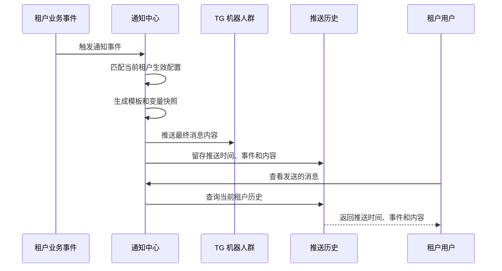

# 租户端通知中心 PRD 附录

> 主 PRD：[PRD_租户端通知中心_20260902.md](./PRD_租户端通知中心_20260902.md)

## 目录

- [A2 目标用户与角色](#a2-目标用户与角色)
- [A3 资料流与系统串接](#a3-资料流与系统串接)
- [A4 非功能性需求](#a4-非功能性需求)

## A2 目标用户与角色

| 角色 | 职责 | 与本需求的关系 |
|---|---|---|
| 租户运营人员 | 查看业务和风控提醒 | 查看 TG 推送历史。 |
| 租户管理员 | 维护租户通知接收范围 | 新增、修改、启停和删除通知配置。 |
| 租户风控人员 | 关注安全和恶意拉单预警 | 查看相关推送历史与预警内容。 |
| 平台管理员 | 授权机器人与治理平台规则 | 提供可被租户选择的机器人范围。 |

## A3 资料流与系统串接

### A3.1 推送与历史留存

### A3.2 业务资料口径

| 资料 | 来源 | 使用方式 |
|---|---|---|
| 通知配置 | 当前租户配置 | 决定是否推送、推送目标和模板。 |
| 业务事件 | 商户资金、钱包、代付、登录安全和风控业务 | 提供触发时的变量值。 |
| TG 推送结果 | 当前租户已授权机器人 | 形成可回看的推送历史。 |
| 推送历史 | 推送时保存的内容快照 | 在发送的消息页展示。 |

## A4 非功能性需求

| 类别 | 要求 | 验收方式 |
|---|---|---|
| 数据隔离 | 所有查询、导出和配置操作均限定当前租户。 | 使用两个租户进行交叉验证。 |
| 内容完整性 | 历史消息正文、模板快照和变量快照不可被后续配置操作覆盖。 | 先推送、后修改配置并对比历史记录。 |
| 访问控制 | 查看、导出和维护能力按租户角色授权。 | 使用不同角色账号验证。 |
| 可用性 | 推送内容在桌面端和常用平板宽度下保持可读、自动换行。 | 在 1440px、1024px、768px 宽度检查。 |
| 性能 | 常用筛选下列表首屏可在 2 秒内展示。 | 使用测试环境连续查询 20 次记录 P95。 |
| 审计 | 配置操作记录操作人、时间、操作类型和删除原因。 | 执行新增、修改、启停、删除后核对记录。 |
